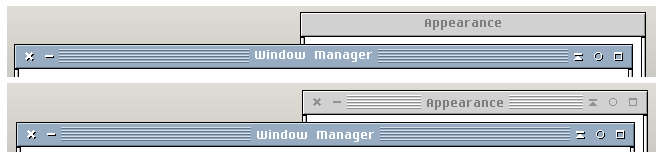
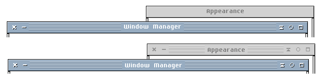
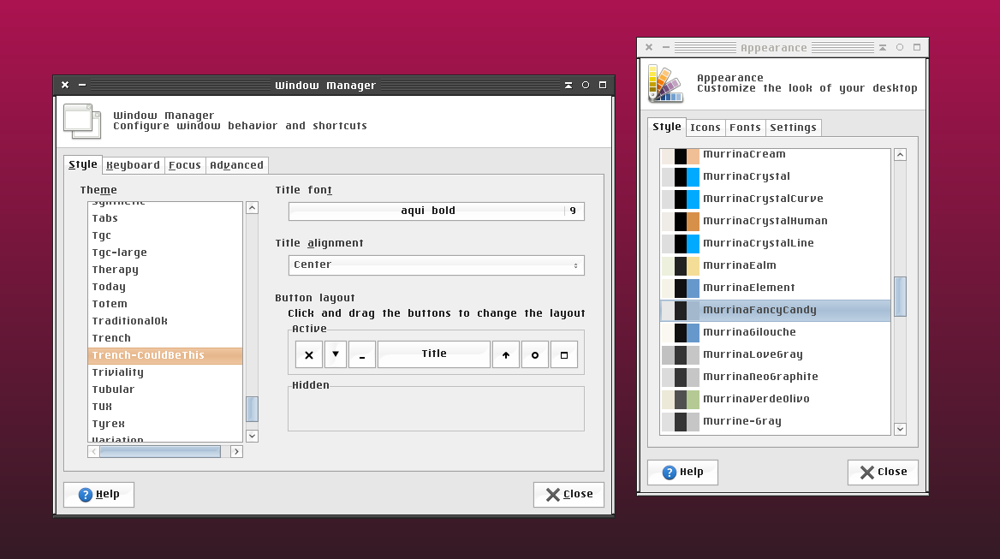

# my tweaks and variations on `xfce4themes`

I like the old school `XFCE` themes but have a few changes to make. 

I am running an older version of `XFCE` and it is my understanding that those running more modern versions will not be able to use these themes either at all or reliably. 

<!--ts-->
* [my tweaks and variations on xfce4themes](#my-tweaks-and-variations-on-xfce4themes)
   * [Install](#install)
   * [Themes](#themes)
      * [xfwm 2022 Trench (regular DPI)](#xfwm-2022-trench-regular-dpi)
         * [Screenshot](#screenshot)
      * [Other components](#other-components)
      * [xfwm 2022 Slimline](#xfwm-2022-slimline)
      * [xfwm 2022 Slimline (HiDPI)](#xfwm-2022-slimline-hidpi)
   * [Breadcrumbs](#breadcrumbs)
   * [References](#references)

<!-- Added at: Fri 13 May 13:50:45 EDT 2022 -->

<!--te-->

## Install 

Not very fancy. For other options

1. Clone repo (must include submodules!)

2. ~~Run the `install.sh` to install for all users (requires password). Or~~ copy manually to `~/.themes` or other theme directory.

3. Open `Window Manager` or `Appearances` or other relevant settings panel to select. 

```zsh
git clone git@github.com:CouldBeThis/_xfce4themes.git CouldBeThis_xfcethemes
cd CouldBeThis_xfcethemes/themes
sudo ./install.sh
```
## Themes

### xfwm 2022 Slimline (HiDPI)

- directory: TBD

- independent repo: TBD

The `2022 slimline` theme with a couple of fixes and scaled up to be nice to use on a HiDPI screen. 

The submodule may not be updated; see the independent repo for most up to date. 

### GTK lwaxana

- directory: [/_xfce4themes/themes/lwaxana](/_xfce4themes/themes/lwaxana)

- independent repo:     [CouldBeThis](https://github.com/CouldBeThis) / **[lwaxana](https://github.com/CouldBeThis/lwaxana)**     

This was originally forked from [Elbullazul](https://github.com/Elbullazul)'s [B00merang-Project](https://github.com/B00merang-Project) / **[Solaris-9](https://github.com/B00merang-Project/Solaris-9)**. I found it much clearer to see what is going on than other themes I had looked in, and since it was already sort of "retro"  I didn't need to remove a bunch of round, transparent or other unwanted aesthetic elements. 

The submodule may not be updated; see the independent repo for most up to date. 

**status:** usable but a bit of a mess

### xfwm `2022 Trench` (regular DPI)

- directory: [`/_xfce4themes/themes/Trench-2022`](/_xfce4themes/themes/Trench-2022)

My version of the classic `XFCE` theme `trench`.
Basically, compared to the original:

 * Inactive windows are no longer totally plain, but instead have light lines and action icons which are similar to the active window's titlebar

   * The inactive icons lack shadows present in the active icons; I felt these were too busy. There is a branch where this is available if anyone wants it.
 * Titlebar text slightly adjusted so that it is centred vertically using my font of choice `aqui`

**status:** usable

#### Screenshot

**screenshot-Trench-CouldBeThis-MurrinaFancyCandy.png:**





**screenshot-Trench-CouldBeThis-MurrinaFancyCandy.png:**



### Other components

The titlebar uses the bitmap font `aqui`. It is available from [Tecate/bitmap-fonts](https://github.com/Tecate/bitmap-fonts). FOr some reason it isn't listed on the README but it is available as both [`.bdf`](https://github.com/Tecate/bitmap-fonts/blob/master/bitmap/artwiz/bdf/aqui.bdf) and [`.pcf`](https://github.com/Tecate/bitmap-fonts/blob/master/bitmap/artwiz/pcf/aqui.pcf). It is only available in one size (9pts). I find that unreadably small on a desktop monitor but on my tiny netbook screen it is perfect.

An extremely viable alternative bitmap font that comes in a variety of sizes is [TamzenForPowerline](https://github.com/sunaku/tamzen-font).

### xfwm `2022 Slimline`  (regular DPI)

- directory: [`/_xfce4themes/themes/slimline-2022`](/_xfce4themes/themes/slimline-2022)

My version of the classic `XFCE` theme `slimline`. Slight tweaks.

**status:** usable with minor imperfections. 

## How to

### Convert `xpm` to `png` images

Rather crude and requires touching up:

```zsh
```


## Credits

### xfwm themes 

 * I forked the full collection to [CouldBeThis/xfwm4-themes](https://github.com/CouldBeThis/xfwm4-themes). To avoid duplication and confusion, I am only moving those themes over to here which I am working on. 
 * Upstream was [Distrotech/xfwm4-themes](https://github.com/Distrotech/xfwm4-themes); it is a mirror of a repo that no longer exists, though it is [archived](https://git.xfce.org/archive/xfwm4-themes). Some [discussion](https://askubuntu.com/questions/1184207/where-can-i-get-xfwm4-themes-on-xubuntu-19-10) of this.

### GTK

[Elbullazul](https://github.com/Elbullazul)'s [B00merang-Project](https://github.com/B00merang-Project) / **[Solaris-9](https://github.com/B00merang-Project/Solaris-9)**

## References

 * [howto:install_new_themes](https://wiki.xfce.org/howto:install_new_themes)

 * [howto:xfwm4_theme](https://wiki.xfce.org/howto/xfwm4_theme)

  * [howto:gtk_theme](https://wiki.xfce.org/howto/gtk_theme)
  * [p0ngbr/xfce-themes: Some xfwm4 themes](https://github.com/p0ngbr/xfce-themes) - another collection of themes (not reviewed)

 

