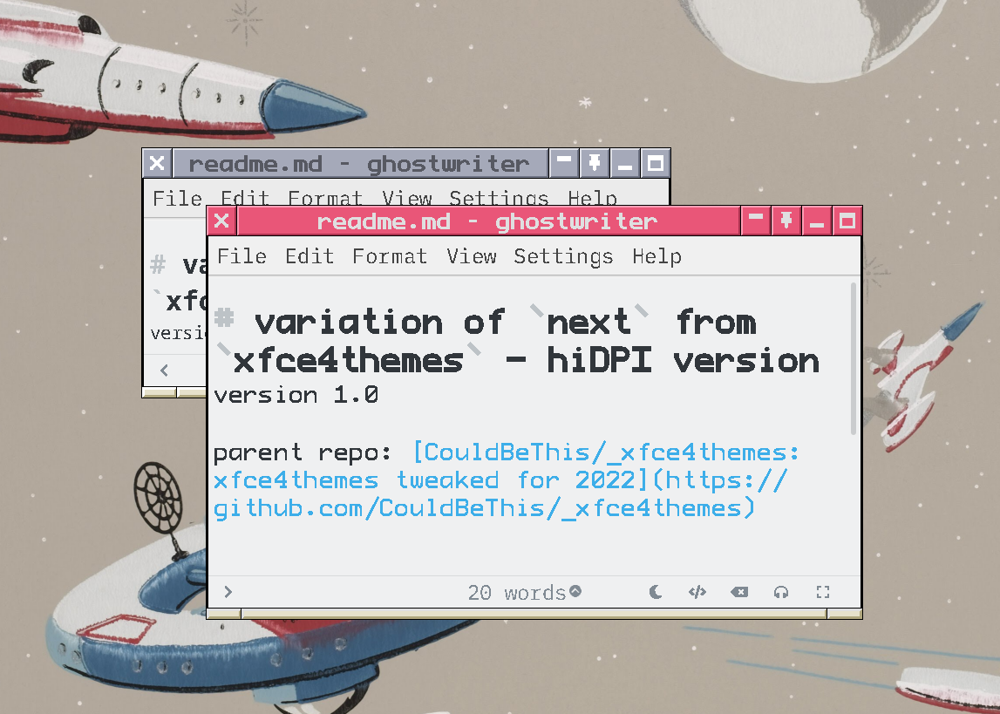
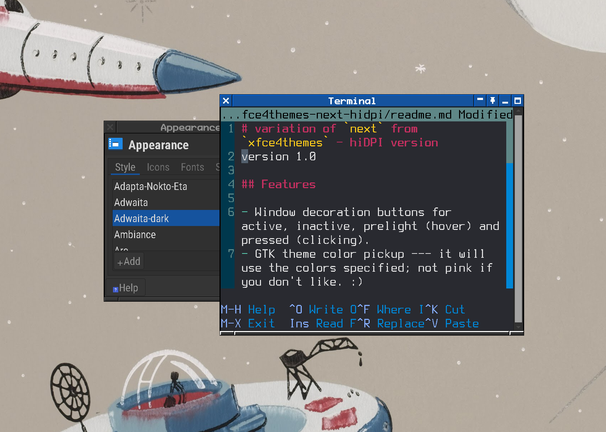

# variation of `next` from `xfce4themes` - hiDPI version 
version 1.0

## Features

- Window decoration buttons for active, inactive, prelight (hover) and pressed (clicking). 
- GTK theme color pickup --- it will use the colors specified in`xfce4-appearance-settings`; not pink if you don't like. 

## Requirements

1. This theme was designed for [Xfce Desktop Environment](https://xfce.org/) on linux. Possibly other combinations can make use of it. 
2. It has been modified with a HiDPI monitor in mind and will look terrible on displays set up otherwise. 

## Installation

Put the directory into your user or system theme directory. You will be able to select this theme in the `Window manager` settings dialogue (`xfwm4-settings`).

more help: [howto:install_new_themes](https://wiki.xfce.org/howto:install_new_themes)

## More information

-  Parent repo for all my related theming: [CouldBeThis/_xfce4themes: xfce4themes tweaked for 2022](https://github.com/CouldBeThis/_xfce4themes)
- See the [`develpment` branch](https://github.com/CouldBeThis/_xfce4themes-next-hidpi/tree/development) of this repo for working files

## Screenshot

### light gtk theme

### dark gtk theme 

## Credits

- the `next` xfwm theme is from the `xfwm4-themes` collection which is available on various repos. Upstream was [Distrotech/xfwm4-themes](https://github.com/Distrotech/xfwm4-themes); it is a mirror of a repo that no longer exists, though it is [archived](https://git.xfce.org/archive/xfwm4-themes). Some [discussion](https://askubuntu.com/questions/1184207/where-can-i-get-xfwm4-themes-on-xubuntu-19-10) of this.
  - I forked the full collection to [CouldBeThis/xfwm4-themes](https://github.com/CouldBeThis/xfwm4-themes). You can find the parent at [xfwm4-themes/themes/next at master](https://github.com/CouldBeThis/xfwm4-themes/tree/master/themes/next)
- background image in screenshots: [Wallpaper with space stations and rockets - Wikimedia Commons](https://commons.wikimedia.org/wiki/File:Wallpaper_with_space_stations_and_rockets_-_Google_Art_Project.jpg) (also from [Smithsonian Design Museum](http://cprhw.tt/o/2Dwk2/))
- I found [this blog post](https://blockofcode.wordpress.com/2009/02/09/making-a-theme-for-xfwm4/) helpful

## License

I believe all the prior works I have used were released under licenses that would permit it although it's bee a bit difficult to locate the details, especially on work which was done >20 years ago. Any original contributions on my part are released under the GNU GENERAL PUBLIC LICENSE.

